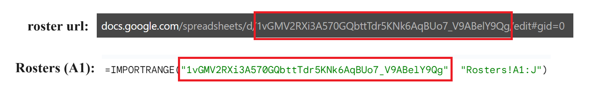

# SparkyStats
Converts excel stat sheets from Quizbowl tournaments to SQBS files. This has been used for every ASU-hosted tournament since 2020. Currently revamping.

## Requirements
You need to [install python](https://wiki.python.org/moin/BeginnersGuide/Download). Once python is installed (any version will probably do), install `omegaconf` and `openpyxl` using the following commands.

`pip install omegaconf`

`pip install openpyxl`

## Guide
1. Create a roster sheet like [this one](https://docs.google.com/spreadsheets/d/1vGMV2RXi3A570GQbttTdr5KNk6AqBUo7_V9ABelY9Qg/edit#gid=0).
2. Create a copy of a template stats sheet ([UCSD](https://docs.google.com/spreadsheets/d/1Yn8gCP4u07dCtWf3WFvc6DgIOi5QNNsU8h6PP-bTbyI/edit#gid=156438897) or [NAQT](https://docs.google.com/spreadsheets/d/1wMzwQ-AGr-TQvuvebL3bLAKLbRJC38zFjz1GoRR5mh4/edit#gid=603156631) or your own). Within each template, there is an empty subsheet (duplicate_me or Spreadsheet in the provided templates) which mods should duplicate and rename (renaming is necessary). Other kinds of template sheets which are similar can probably be used; you will need to create a custom profile in `tournament_settings.yaml`.
3. In your copy of the stats template, go to the "Rosters" subsheet and change cell A1 by replacing the first item in the IMPORTRANGE tuple with the appropriate URL information from the roster sheet.
4. Duplicate this template sheet if desired (e.g., you want each mod to own a stats sheet).

4. Adjust `tournament_settings.yaml` to fit your tournament's specifications.
5. Download all sheets as excel sheets (.xlsx) and move them to a folder. This folder should contain a "roster.xlsx" or a "Roster.xlsx" file, along with all stats sheets for the tournament.
5. Run `python -m read` and provide either the absolute or relative path to the folder you moved the sheets to.
6. Heed warnings which appear.
7. The desired sqbs file should be written in the specified folder.
### Things to do Manually
1. Forfeits are not checked for. It is advisable for moderators to add that information to "Issues" in the scoresheets so that they show up as warnings.
2. I was too lazy to implement divisions, though it probably isn't that much work. If divisions are required, they should be handled manually for now.
3. Overtime with no bonuses should also be handled manually. Like the forfeits, this should be added to "Issues" so a warning shows up.
### Common Scorekeeping Mistakes
1. Ensure scorekeepers fill in TUH for each game in their sheets.
2. Ensure scoreekepers fill in the round number for each game in their sheets.
3. Don't delete formulas in the scoresheets. If something gets screwed up, it may be worth it to re-duplicate the empty scoresheet. I tried to put warnings on all the formulas, but it's easy to ignore the warnings that pop up.
